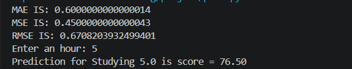

# 🎓 Student Score Prediction Using Linear Regression

## 📌 Project Overview

This project uses **Linear Regression** to predict a student's score based on the number of hours they studied.

The model is also evaluated using different error metrics to measure its performance.

## 🛠️ Technologies Used

* Python
* Pandas
* NumPy
* Scikit-learn

## 📂 Dataset

The dataset contains the following columns:

* **Hours** – Number of hours studied
* **Score** – Student's score

## ⚙️ How It Works

1. The dataset is loaded using Pandas.
2. **Hours** is selected as the input feature.
3. **Score** is selected as the target variable.
4. A Linear Regression model is trained.
5. The model predicts student scores.
6. The model performance is evaluated using MAE, MSE, and RMSE.
7. The user can enter the number of study hours to predict a score.

## 📊 Evaluation Metrics

The model uses the following metrics:

* **MAE (Mean Absolute Error)**
* **MSE (Mean Squared Error)**
* **RMSE (Root Mean Squared Error)**

## ▶️ How to Run the Project

### 1. Clone the repository

```bash
git clone <your-repository-link>
```

### 2. Install the required libraries

```bash
pip install -r requirements.txt
```

### 3. Run the Python file

```bash
python student_score_prediction.py
```

## 💻 Sample Output

```text
Enter an hour: 6
Predicted Score for Studying 6.0 is = 82.70
```

## 🖼️ Output Screenshot



## 📁 Project Structure

```text
Student-Score-Prediction/
│
├── student_score_prediction.py
├── Sample_Short_Data_student.csv
├── requirements.txt
├── README.md
└─ output.png
```

## 🚀 Future Improvements

* Add a train-test split for better model evaluation.
* Add data visualization.
* Use a larger dataset.
* Improve the prediction interface.

